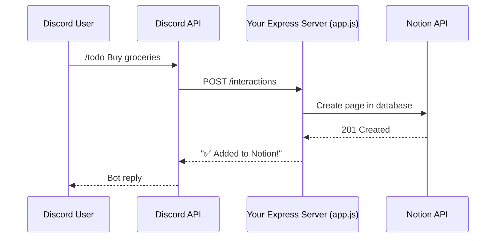

# Discord → Notion Integration Guide

Send a Discord slash command and have it create a to-do (or any block) in a Notion page — all from your existing `discord-example-app`.

---

## Architecture Overview



Your server already receives Discord interactions. You just need to:
1. Add a new slash command (`/todo`)
2. Install the Notion SDK
3. Call the Notion API inside your interaction handler

---

## Step 1 — Set Up a Notion Integration

1. Go to [https://www.notion.so/my-integrations](https://www.notion.so/my-integrations)
2. Click **"+ New integration"**
3. Give it a name (e.g. `Discord Bot`) and select the workspace you want it in
4. Under **Capabilities**, ensure **Read content**, **Insert content**, and **Update content** are checked
5. Click **Submit** → copy the **Internal Integration Secret** (starts with `ntn_`)

> [!IMPORTANT]
> Keep this secret safe — treat it like a password. You'll add it to your `.env` file.

---

## Step 2 — Create a Notion Database & Share It

You need a Notion **database** (table) where to-dos will be created as pages.

1. Open Notion in your browser
2. Create a new **full-page database** (type `/database` → choose "Database - Full page")
3. Name it something like `Discord To-Dos`
4. Set up at minimum these properties:

| Property Name | Type       | Purpose                        |
|---------------|------------|--------------------------------|
| `Name`        | Title      | The to-do text (default column)|
| `Status`      | Status     | Not Started / In Progress / Done |
| `Discord User`| Rich text | Who sent the command           |
| `Created`     | Date       | When it was added              |

5. **Connect your integration** — click the `•••` menu (top-right of the database page) → **Connections** → find and add your `Discord Bot` integration

6. **Copy the Database ID** — open the database as a full page, the URL will look like:
   ```
   https://www.notion.so/yourworkspace/abc123def456...?v=...
                                       ^^^^^^^^^^^^^^^^
                                       This is your Database ID
   ```
   It's the 32-character hex string before the `?v=` query param. Format it with dashes as a UUID: `abc123de-f456-...`

> [!CAUTION]
> If you skip connecting the integration to the database, all API calls will return **403 Unauthorized**.

---

## Step 3 — Add Environment Variables

Add two new variables to your `.env` file:

```diff
 APP_ID=<YOUR_APP_ID>
 DISCORD_TOKEN=<YOUR_BOT_TOKEN>
 PUBLIC_KEY=<YOUR_PUBLIC_KEY>
+NOTION_TOKEN=<YOUR_NOTION_INTEGRATION_SECRET>
+NOTION_DATABASE_ID=<YOUR_DATABASE_ID>
```

---

## Step 4 — Install the Notion SDK

```bash
npm install @notionhq/client
```

This adds the official Notion client to your project.

---

## Step 5 — Create [notion.js](file:///Users/kelaba/Projects/discord-dev/discord-example-app/notion.js) (Notion Helper Module)

Create a new file [notion.js](file:///Users/kelaba/Projects/discord-dev/discord-example-app/notion.js) alongside your other files:

```js
// notion.js
import 'dotenv/config';
import { Client } from '@notionhq/client';

const notion = new Client({ auth: process.env.NOTION_TOKEN });
const databaseId = process.env.NOTION_DATABASE_ID;

/**
 * Creates a new to-do page in the Notion database.
 * @param {string} title - The to-do text
 * @param {string} discordUser - The Discord username
 * @returns {object} The created Notion page
 */
export async function createTodo(title, discordUser) {
  const response = await notion.pages.create({
    parent: { database_id: databaseId },
    properties: {
      // "Name" is the title property of your database
      Name: {
        title: [
          {
            text: { content: title },
          },
        ],
      },
      // "Status" — set to "Not Started" by default
      Status: {
        status: { name: 'Not started' },
      },
      // "Discord User" — rich text property
      'Discord User': {
        rich_text: [
          {
            text: { content: discordUser },
          },
        ],
      },
      // "Created" — date property
      Created: {
        date: { start: new Date().toISOString() },
      },
    },
  });

  return response;
}
```

> [!NOTE]
> The **property names** in this code (e.g. `Name`, `Status`, `Discord User`, `Created`) must **exactly match** the property names in your Notion database — including capitalization and spaces.

---

## Step 6 — Register the `/todo` Slash Command

Edit [commands.js](file:///Users/kelaba/Projects/discord-dev/discord-example-app/commands.js) to add the new command:

```diff
 // Simple test command
 const TEST_COMMAND = {
   name: 'test',
   description: 'Basic command',
   type: 1,
   integration_types: [0, 1],
   contexts: [0, 1, 2],
 };

+// Notion to-do command
+const TODO_COMMAND = {
+  name: 'todo',
+  description: 'Add a to-do item to Notion',
+  options: [
+    {
+      type: 3,          // STRING type
+      name: 'task',
+      description: 'What needs to be done?',
+      required: true,
+    },
+  ],
+  type: 1,
+  integration_types: [0, 1],
+  contexts: [0, 1, 2],
+};
+
-const ALL_COMMANDS = [TEST_COMMAND, CHALLENGE_COMMAND];
+const ALL_COMMANDS = [TEST_COMMAND, CHALLENGE_COMMAND, TODO_COMMAND];
```

Then re-register your commands:

```bash
npm run register
```

---

## Step 7 — Handle the `/todo` Command in [app.js](file:///Users/kelaba/Projects/discord-dev/discord-example-app/app.js)

Edit [app.js](file:///Users/kelaba/Projects/discord-dev/discord-example-app/app.js):

**A) Add the import at the top:**

```diff
 import { getRandomEmoji, DiscordRequest } from './utils.js';
 import { getShuffledOptions, getResult } from './game.js';
+import { createTodo } from './notion.js';
```

**B) Add the command handler inside the `InteractionType.APPLICATION_COMMAND` block, after the `test` command handler:**

```diff
     // "test" command
     if (name === 'test') {
       // ... existing test handler ...
     }

+    // "todo" command — creates a Notion to-do
+    if (name === 'todo') {
+      // Get the task text from the command option
+      const taskText = data.options.find(opt => opt.name === 'task').value;
+      // Get the Discord user who sent the command
+      const username = req.body.member?.user?.username
+                    ?? req.body.user?.username
+                    ?? 'Unknown';
+
+      try {
+        await createTodo(taskText, username);
+
+        return res.send({
+          type: InteractionResponseType.CHANNEL_MESSAGE_WITH_SOURCE,
+          data: {
+            flags: InteractionResponseFlags.IS_COMPONENTS_V2,
+            components: [
+              {
+                type: MessageComponentTypes.TEXT_DISPLAY,
+                content: `✅ Added to Notion: **${taskText}**`,
+              },
+            ],
+          },
+        });
+      } catch (error) {
+        console.error('Notion API error:', error);
+        return res.send({
+          type: InteractionResponseType.CHANNEL_MESSAGE_WITH_SOURCE,
+          data: {
+            flags: InteractionResponseFlags.IS_COMPONENTS_V2,
+            components: [
+              {
+                type: MessageComponentTypes.TEXT_DISPLAY,
+                content: '❌ Failed to add to-do to Notion. Check server logs.',
+              },
+            ],
+          },
+        });
+      }
+    }

     console.error(`unknown command: ${name}`);
```

---

## Step 8 — Expose Your Server Publicly (ngrok)

Discord sends interactions to a **public URL** — it cannot reach `localhost`. Use ngrok to create a tunnel:

```bash
# Install ngrok (one time)
brew install ngrok

# In a separate terminal, expose port 3000
ngrok http 3000
```

Ngrok will print a forwarding URL like `https://abc123.ngrok-free.app`. Copy it.

### Update the Discord Interactions Endpoint URL

1. Go to [https://discord.com/developers/applications](https://discord.com/developers/applications) → your app
2. Click **General Information**
3. Set **Interactions Endpoint URL** to your ngrok URL + `/interactions`:
   ```
   https://abc123.ngrok-free.app/interactions
   ```
4. Click **Save Changes** — Discord will ping your server to verify it responds

> [!NOTE]
> Every time you restart ngrok you get a new URL. You'll need to update the Interactions Endpoint URL in the Discord portal again. To avoid this, sign up for a free ngrok account and use a static domain.

---

## Step 9 — Test It

1. **Start your server** (if not already running):
   ```bash
   npm run dev
   ```
2. Make sure ngrok is running and the Interactions Endpoint URL is up to date
3. In Discord, type:
   ```
   /todo task: Buy groceries
   ```
4. You should see:
   - A bot reply: `✅ Added to Notion: **Buy groceries**`
   - A new row appear in your Notion database

---

## Step 9 (Optional) — Extend It Further

Here are ideas once the basic flow works:

| Enhancement | How |
|---|---|
| **Set priority** | Add a `Select` property in Notion + an option to the `/todo` command |
| **Set due date** | Add a `Date` property and a date option to the command |
| **List to-dos** | Create a `/todos` command that queries the Notion database via `notion.databases.query()` |
| **Mark as done** | Use message buttons/components to update the page's status via `notion.pages.update()` |
| **Categorize** | Add a `Multi-select` property for tags/categories |

---

## Troubleshooting

| Problem | Fix |
|---|---|
| `403` from Notion API | You forgot to connect the integration to the database (Step 2.5) |
| `400` / property errors | Your property names in [notion.js](file:///Users/kelaba/Projects/discord-dev/discord-example-app/notion.js) don't exactly match the Notion database column names |
| Command not showing in Discord | Re-run `npm run register` and wait a few minutes for global commands to propagate |
| `NOTION_TOKEN` undefined | Make sure your `.env` file is saved and the server was restarted |

---

## File Summary

After completing this guide, your project will look like:

```
discord-example-app/
├── .env              ← updated with NOTION_TOKEN + NOTION_DATABASE_ID
├── app.js            ← updated with /todo handler
├── commands.js       ← updated with TODO_COMMAND
├── notion.js         ← NEW — Notion API helper
├── game.js           ← unchanged
├── utils.js          ← unchanged
├── package.json      ← @notionhq/client added to dependencies
└── ...
```
